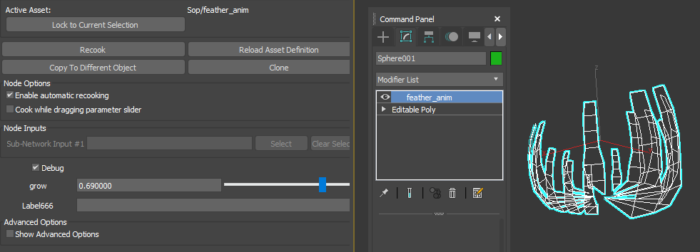

### 生长动画（可用于羽毛，树叶等）
* 根据连接性将mesh分割成面元，比如一片树叶为一个面元。生长动画是以面元为单位，接下来的计算也都以面元为单位。
* 为面元计算一个起始点。这里用的uv坐标最小两个点的连线中点作为起始点。（即假设要生长的东西在贴图里都是朝上的）
* 计算每个顶点到起始点的向量，并变换到切线空间。将向量保存到UV通道。使用切线空间是因为这样可以支持蒙皮网格。
* 计算每个面元的面积，并归一化。为每个面元计算一个随机值。将它们存到UV通道或者顶点色通道。它们将被用来丰富顶点动画的表现。
* 在shader中将向量变换到模型空间，乘以01之间的缩放系数，加到顶点位置上，即可实现生长动画。

可以在max中通过houdini插件进行编辑和预览效果

